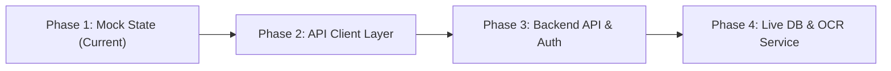

# eSKala — Backend Integration Guide & API Contract
**Step-by-Step Transition Guide from Mock Data to Live REST API**

---

## 1. Integration Architecture & Strategy

To transition eSKala from mock data (`frontend/src/data/mockData.ts` & `frontend/src/services/auth.ts`) to a production backend (FastAPI, Express, or Supabase), follow this 4-step migration strategy:



### 1.1 Key Principles
1. **Zero Breaking UI Changes**: The frontend UI components (`App.tsx`, `SKHome.tsx`, `SuperAdminHome.tsx`, etc.) rely on the clean interfaces in `src/types.ts`. All API responses MUST match these interfaces.
2. **Centralized HTTP Client**: Replace direct `mockData` imports with an Axios/Fetch client wrapper that attaches JWT Bearer tokens to every request.
3. **Environment Variable Configuration**: Use `.env` variables (`VITE_API_BASE_URL`) for seamless switching between local dev, staging, and production API servers.

---

## 2. Authentication & Authorization API Contract

### 2.1 Login Endpoint
- **URL**: `POST /api/v1/auth/login`
- **Headers**: `Content-Type: application/json`
- **Request Body**:
```json
{
  "credential": "superadmin@eskala.ph",
  "password": "Admin2026!",
  "rememberMe": true
}
```
- **Response `200 OK`**:
```json
{
  "accessToken": "eyJhbGciOiJIUzI1NiIsInR5cCI6IkpXVCJ9...",
  "tokenType": "Bearer",
  "expiresIn": 86400,
  "user": {
    "id": "u-admin",
    "name": "SCC Super Admin",
    "email": "superadmin@eskala.ph",
    "username": "superadmin",
    "role": "superadmin",
    "isStaRosa": true,
    "isActive": true
  }
}
```

### 2.2 Register Endpoint
- **URL**: `POST /api/v1/auth/register`
- **Request Body**:
```json
{
  "name": "Juan dela Cruz",
  "email": "juan@example.com",
  "username": "juandelacruz",
  "password": "Citizen2026!",
  "barangay": "Balibago",
  "isStaRosa": true
}
```
- **Response `201 Created`**: Returns JWT `accessToken` and `user` object with `role: "citizen"`.

### 2.3 Get Current User Profile
- **URL**: `GET /api/v1/auth/me`
- **Headers**: `Authorization: Bearer <token>`
- **Response `200 OK`**: Returns current `UserAccount` object.

---

## 3. Project Management API Contract

### 3.1 Get All Projects (with Barangay & Status Filter)
- **URL**: `GET /api/v1/projects?barangay=Balibago&status=ongoing&search=Digital`
- **Headers**: `Authorization: Bearer <token>` (optional for public views)
- **Response `200 OK`**:
```json
[
  {
    "id": "PRJ-001",
    "barangay": "Balibago",
    "category": "Education",
    "title": "Youth Digital Literacy Program",
    "status": "ongoing",
    "progress": 74,
    "proposedBudget": 450000,
    "spent": 333000,
    "startDate": "2025-05-10",
    "endDate": "2025-09-15",
    "description": "Training youth in digital skills and software tools."
  }
]
```

### 3.2 Create Project (SK Chairperson / Secretary Only)
- **URL**: `POST /api/v1/projects`
- **Headers**: `Authorization: Bearer <token>`, `Content-Type: application/json`
- **Request Body**:
```json
{
  "title": "Barangay Youth Health Camp 2025",
  "category": "Health & Wellness",
  "proposedBudget": 150000,
  "startDate": "2025-08-01",
  "endDate": "2025-09-30",
  "description": "Barangay-wide health awareness campaign."
}
```
- **Response `201 Created`**: Returns created `ReportProject` object.

---

## 4. Receipts & OCR Scanner API Contract

### 4.1 Upload & Scan Receipt (SK Chairperson / Treasurer Only)
- **URL**: `POST /api/v1/receipts/upload`
- **Headers**: `Authorization: Bearer <token>`, `Content-Type: multipart/form-data`
- **Form Data**:
  - `file`: (Binary image file JPG/PNG/PDF)
  - `projectId`: `"PRJ-001"`
  - `vendor`: `"Tech4Youth Inc."`
  - `amount`: `125000`
- **Response `201 Created`**:
```json
{
  "id": "R-001",
  "projectId": "PRJ-001",
  "projectTitle": "Youth Digital Literacy Program",
  "barangay": "Balibago",
  "vendor": "Tech4Youth Inc.",
  "amount": 125000,
  "extractedAmount": 125000,
  "date": "2025-07-10",
  "status": "verified",
  "ocrExtracted": true,
  "imageUrl": "/uploads/receipts/R-001.png"
}
```

---

## 5. Citizen Comments & Community Feedback API Contract

### 5.1 Get Comments for Barangay / Project
- **URL**: `GET /api/v1/comments?barangay=Balibago`
- **Response `200 OK`**: Returns array of `CitizenComment` objects.

### 5.2 Submit Comment / Suggestion
- **URL**: `POST /api/v1/comments`
- **Request Body**:
```json
{
  "projectId": "PRJ-001",
  "barangay": "Balibago",
  "text": "Great project! Looking forward to the next session.",
  "type": "suggestion"
}
```

---

## 6. City News & Announcements API Contract (Super Admin)

- **GET `/api/v1/news`**: Returns array of `NewsItem` objects.
- **POST `/api/v1/news`**: Create news article (Super Admin only).
- **PUT `/api/v1/news/{id}`**: Update news article.
- **DELETE `/api/v1/news/{id}`**: Delete news article.

---

## 7. Account Management & System Audit Logs (Super Admin)

- **GET `/api/v1/admin/accounts`**: Returns all user account records.
- **PATCH `/api/v1/admin/accounts/{id}/toggle-active`**: Suspend or reactivate user account.
- **GET `/api/v1/admin/activity-logs`**: Returns system activity audit trail.

---

## 8. Recommended Frontend API Client Setup (`src/services/apiClient.ts`)

Create a unified HTTP client instance to replace direct mock file imports:

```typescript
import axios from 'axios'

const API_BASE = import.meta.env.VITE_API_BASE_URL || 'http://localhost:8000/api/v1'

export const apiClient = axios.create({
  baseURL: API_BASE,
  headers: {
    'Content-Type': 'application/json',
  },
})

// Attach Bearer Token to outgoing requests
apiClient.interceptors.request.use((config) => {
  const token = localStorage.getItem('eskala_token') || sessionStorage.getItem('eskala_token')
  if (token) {
    config.headers.Authorization = `Bearer ${token}`
  }
  return config
})
```
