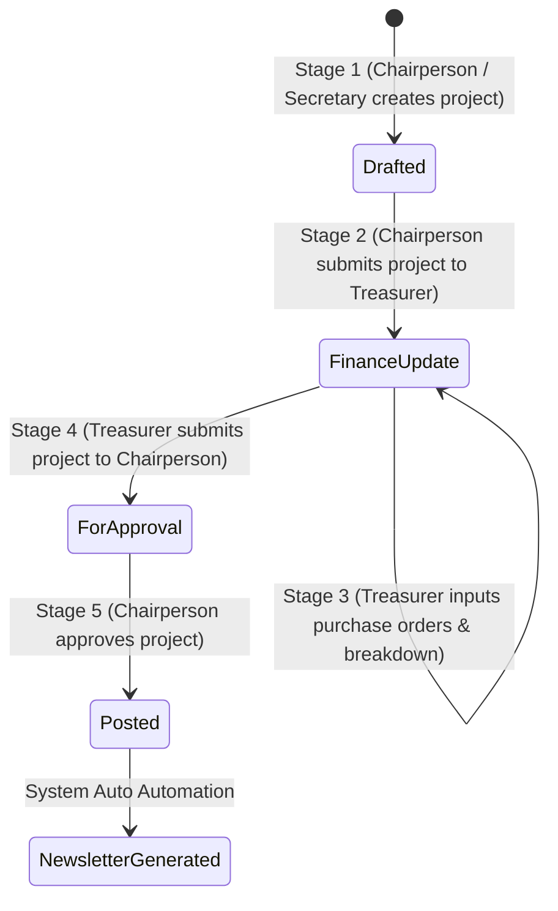

# eSKala — Backend Integration Guide & API Contract
**Reflected from Meeting Specification & Final Architecture Agreement**

---

## 1. Project Workflow Lifecycle & API Endpoint Contract

---

## 2. API Endpoints by Module

### 2.1 Module 1 — System Administrator & Authentication
- **POST `/api/v1/auth/login`**: Credential & password authentication.
- **POST `/api/v1/auth/register`**: Self-registration for Guests/Citizens (`userRole = Guest`, `userIsSK = FALSE`).
- **POST `/api/v1/admin/accounts`**: Super Admin provisions SK Chairperson, Secretary, or Treasurer account (`userRole = Assigned Role`, `userIsSK = TRUE`, `userSKTermStart`, `userSKTermEnd`).
- **GET `/api/v1/admin/accounts?barangay=Balibago`**: List all user accounts with barangay filtering.
- **PATCH `/api/v1/admin/accounts/{id}/toggle-active`**: Suspend / reactivate account.
- **DELETE `/api/v1/admin/accounts/{id}`**: Soft delete account (`userIsDeleted = TRUE`).

### 2.2 Module 2 — Reports & Dashboards
- **GET `/api/v1/reports/consolidated`**: Financial summaries across all 18 Santa Rosa City barangays.
- **GET `/api/v1/reports/barangay/{barangayName}`**: Scoped financial metrics, budget vs spent, and project counts for a specific barangay.
- **GET `/api/v1/reports/export-zip/{projectID}`**: Export all financial documents and purchase orders for a project as a `.zip` archive.

### 2.3 Module 3 & 4 — Finance MIS & OCR Scanning
- **POST `/api/v1/finance/purchase-orders`**: SK Treasurer creates purchase order (`orderID`, `projectID`, `orderName`, `orderType`, `orderQty`, `orderPrice`).
- **POST `/api/v1/finance/upload-receipt`**: Upload purchase order receipt. System automatically triggers OCR scanning to extract `orderPrice` and vendor name (`isOCRScanned = TRUE`). Manual price override is allowed (`isManuallyOverridden = TRUE`).
- **POST `/api/v1/finance/upload-annual-budget`**: Upload Annual Budget Report PDF. System OCR scans budget year and value, and generates an audit log entry.
- **PATCH `/api/v1/finance/purchase-orders/{orderID}/approve`**: SK Chairperson approves or rejects purchase order.

### 2.4 Module 5 — Audit Trail Tracker
- **GET `/api/v1/audit-logs`**: Public/Super Admin read tracker.
- **GET `/api/v1/audit-logs/export?format=pdf`**: Download audit log report as PDF or CSV for DILG/COA audit compliance.

### 2.5 Module 6 — Suggestion & Comment Threading
- **GET `/api/v1/projects/{projectID}/comments`**: View all comments for a project (includes root comments and threaded replies via `parentCommentID`).
- **POST `/api/v1/projects/{projectID}/comments`**: Submit comment or suggestion (`commentType = 'comment' | 'suggestion'`).
- **POST `/api/v1/comments/{commentID}/reply`**: Chairperson, Secretary, Treasurer, or Citizen submits a threaded reply (`parentCommentID = commentID`).

### 2.6 Module 7 — Repository & Project 5-Stage Approval Workflow
- **POST `/api/v1/projects`**: Chairperson or Secretary drafts project (`projectStatus = 'Drafted'`).
- **PATCH `/api/v1/projects/{id}/submit-to-finance`**: Chairperson submits project to Treasurer (`projectStatus = 'Finance Update'`).
- **PATCH `/api/v1/projects/{id}/update-breakdown`**: Treasurer submits financial breakdown (`projectBreakdown` REQUIRED).
- **PATCH `/api/v1/projects/{id}/submit-for-approval`**: Treasurer submits project back to Chairperson (`projectStatus = 'For Approval'`).
- **PATCH `/api/v1/projects/{id}/approve-post`**: Chairperson gives final approval (`projectStatus = 'Posted'`).
  - **System Automation**: Triggers automatic entry into `newsletter` table and broadcasts project update to public home dashboard!
