# eSKala — Entity-Relationship Diagram (ERD) & Database Schema
**Reflected from Meeting Specification & Final Architecture Agreement**

---

## 1. Complete Mermaid ERD Diagram

```mermaid
erDiagram
    users ||--o{ projects : "creates (createdBy)"
    users ||--o{ annual_budget_reports : "uploads (uploadedBy)"
    users ||--o{ audit_logs : "performs (actorID)"
    users ||--o{ comments : "authors"

    projects ||--o{ attachments : "has (1:N)"
    projects ||--o{ purchase_orders : "has (1:N)"
    projects ||--o{ comments : "receives (1:N)"
    projects ||--o| newsletter : "generates upon Posted (1:1)"

    comments ||--o{ comments : "reply to (parentCommentID)"

    users {
        int userID PK
        string userName
        string userEmail UK
        string userPassword
        string userHashedPassword
        boolean userIsStaRosa
        string userLocation "Barangay Name"
        timestamp userDateCreated
        timestamp userUpdatedAt
        string userProfilePicture
        enum userRole "Super Admin, SK Treasurer, SK Chairperson, SK Secretary, Guest"
        boolean userIsSK
        date userSKTermStart
        date userSKTermEnd
        boolean userIsActive
        boolean userIsDeleted
    }

    projects {
        int projectID PK
        string projectName
        text projectDescription
        datetime projectStartTime
        datetime projectEndTime
        string projectLocation "Barangay"
        int projectCreatedBy FK
        decimal projectBreakdown "Filled by Treasurer"
        enum projectStatus "Drafted, Finance Update, For Approval, Posted"
        boolean isDeleted
        timestamp createdAt
        timestamp updatedAt
    }

    attachments {
        int attachfile_ID PK
        int attachfile_for FK "projects.projectID"
        string attachFileLink
        boolean hasOrderID
        string orderID FK "purchase_orders.orderID"
    }

    purchase_orders {
        string orderID PK
        int projectID FK "projects.projectID"
        string orderName
        enum orderType "Physical, Service"
        decimal orderQty
        decimal orderPrice
        decimal orderTotalPrice "Calculated"
        string receiptImageURL
        boolean isOCRScanned
        boolean isManuallyOverridden
        timestamp createdAt
    }

    comments {
        int commentID PK
        int commentFor FK "projects.projectID"
        int parentCommentID FK "comments.commentID for replies"
        int authorID FK "users.userID"
        string commentName
        text commentDetails
        enum commentType "comment, suggestion"
        int votesCount
        timestamp commentTimestamp
    }

    newsletter {
        int newsletterID PK
        int projectID FK "projects.projectID"
        string projectName
        text projectDescription
        datetime projectStartTime
        datetime projectEndTime
        string projectLocation
        int projectCreatedBy FK
        decimal projectBreakdown
        enum projectStatus "Posted"
        timestamp publishedAt
    }

    annual_budget_reports {
        int budgetID PK
        string budgetBarangay "Santa Rosa Barangays"
        int budgetUploadedBy FK "users.userID"
        int budgetYear
        decimal budgetValue
        datetime budgetUploadedOn
        boolean isOCRScanned
        boolean isManuallyOverridden
    }

    audit_logs {
        int logID PK
        int actorID FK "users.userID"
        string actorName
        string actionType
        string targetModule
        text details
        timestamp timestamp
    }
```



---

## 2. PostgreSQL DDL SQL Schema Script

```sql
-- =============================================================================
-- eSKala PostgreSQL Database Schema
-- Aligned with Final Meeting Specification
-- =============================================================================

CREATE EXTENSION IF NOT EXISTS "uuid-ossp";

-- -----------------------------------------------------------------------------
-- ENUM TYPES
-- -----------------------------------------------------------------------------
CREATE TYPE user_role_enum AS ENUM ('Super Admin', 'SK Treasurer', 'SK Chairperson', 'SK Secretary', 'Guest');
CREATE TYPE project_status_enum AS ENUM ('Drafted', 'Finance Update', 'For Approval', 'Posted');
CREATE TYPE order_type_enum AS ENUM ('Physical', 'Service');
CREATE TYPE comment_type_enum AS ENUM ('comment', 'suggestion');

-- -----------------------------------------------------------------------------
-- TABLE: USERS
-- -----------------------------------------------------------------------------
CREATE TABLE users (
    userID SERIAL PRIMARY KEY,
    userName VARCHAR(100) NOT NULL,
    userEmail VARCHAR(150) UNIQUE NOT NULL,
    userPassword VARCHAR(255) NULL,
    userHashedPassword VARCHAR(255) NOT NULL,
    userIsStaRosa BOOLEAN DEFAULT TRUE,
    userLocation VARCHAR(100) NOT NULL, -- Official Santa Rosa Barangay
    userDateCreated TIMESTAMP DEFAULT CURRENT_TIMESTAMP,
    userUpdatedAt TIMESTAMP DEFAULT CURRENT_TIMESTAMP,
    userProfilePicture VARCHAR(500) DEFAULT 'profile_picture.png',
    userRole user_role_enum NOT NULL DEFAULT 'Guest',
    userIsSK BOOLEAN DEFAULT FALSE,
    userSKTermStart DATE NULL,
    userSKTermEnd DATE NULL,
    userIsActive BOOLEAN DEFAULT TRUE,
    userIsDeleted BOOLEAN DEFAULT FALSE
);

-- -----------------------------------------------------------------------------
-- TABLE: PROJECTS
-- -----------------------------------------------------------------------------
CREATE TABLE projects (
    projectID SERIAL PRIMARY KEY,
    projectName VARCHAR(255) NOT NULL,
    projectDescription TEXT NULL,
    projectStartTime TIMESTAMP NOT NULL,
    projectEndTime TIMESTAMP NOT NULL,
    projectLocation VARCHAR(100) NOT NULL,
    projectCreatedBy INT NOT NULL REFERENCES users(userID) ON DELETE CASCADE,
    projectBreakdown DECIMAL(12, 2) NULL, -- Required when Treasurer updates
    projectStatus project_status_enum NOT NULL DEFAULT 'Drafted',
    isDeleted BOOLEAN DEFAULT FALSE,
    createdAt TIMESTAMP DEFAULT CURRENT_TIMESTAMP,
    updatedAt TIMESTAMP DEFAULT CURRENT_TIMESTAMP
);

-- -----------------------------------------------------------------------------
-- TABLE: PURCHASE_ORDERS
-- -----------------------------------------------------------------------------
CREATE TABLE purchase_orders (
    orderID VARCHAR(100) PRIMARY KEY,
    projectID INT NOT NULL REFERENCES projects(projectID) ON DELETE CASCADE,
    orderName VARCHAR(255) NOT NULL,
    orderType order_type_enum NOT NULL DEFAULT 'Physical',
    orderQty DECIMAL(10, 2) NOT NULL DEFAULT 1.0,
    orderPrice DECIMAL(12, 2) NOT NULL DEFAULT 0.00,
    orderTotalPrice DECIMAL(12, 2) GENERATED ALWAYS AS (orderQty * orderPrice) STORED,
    receiptImageURL VARCHAR(500) NULL,
    isOCRScanned BOOLEAN DEFAULT FALSE,
    isManuallyOverridden BOOLEAN DEFAULT FALSE,
    createdAt TIMESTAMP DEFAULT CURRENT_TIMESTAMP
);

-- -----------------------------------------------------------------------------
-- TABLE: ATTACHMENTS
-- -----------------------------------------------------------------------------
CREATE TABLE attachments (
    attachfile_ID SERIAL PRIMARY KEY,
    attachfile_for INT NOT NULL REFERENCES projects(projectID) ON DELETE CASCADE,
    attachFileLink VARCHAR(500) NOT NULL,
    hasOrderID BOOLEAN DEFAULT FALSE,
    orderID VARCHAR(100) NULL REFERENCES purchase_orders(orderID) ON DELETE SET NULL,
    createdAt TIMESTAMP DEFAULT CURRENT_TIMESTAMP
);

-- -----------------------------------------------------------------------------
-- TABLE: COMMENTS (Includes Parent Comment ID for Threaded Replies)
-- -----------------------------------------------------------------------------
CREATE TABLE comments (
    commentID SERIAL PRIMARY KEY,
    commentFor INT NOT NULL REFERENCES projects(projectID) ON DELETE CASCADE,
    parentCommentID INT NULL REFERENCES comments(commentID) ON DELETE CASCADE, -- NULL = Root Comment, INT = Reply
    authorID INT NOT NULL REFERENCES users(userID) ON DELETE CASCADE,
    commentName VARCHAR(150) NOT NULL,
    commentDetails TEXT NOT NULL,
    commentType comment_type_enum DEFAULT 'comment',
    votesCount INT DEFAULT 0,
    commentTimestamp TIMESTAMP DEFAULT CURRENT_TIMESTAMP
);

-- -----------------------------------------------------------------------------
-- TABLE: NEWSLETTER (Automatically populated when projectStatus = 'Posted')
-- -----------------------------------------------------------------------------
CREATE TABLE newsletter (
    newsletterID SERIAL PRIMARY KEY,
    projectID INT NOT NULL REFERENCES projects(projectID) ON DELETE CASCADE,
    projectName VARCHAR(255) NOT NULL,
    projectDescription TEXT NULL,
    projectStartTime TIMESTAMP NOT NULL,
    projectEndTime TIMESTAMP NOT NULL,
    projectLocation VARCHAR(100) NOT NULL,
    projectCreatedBy INT NOT NULL REFERENCES users(userID),
    projectBreakdown DECIMAL(12, 2) NOT NULL,
    projectStatus project_status_enum NOT NULL DEFAULT 'Posted',
    publishedAt TIMESTAMP DEFAULT CURRENT_TIMESTAMP
);

-- -----------------------------------------------------------------------------
-- TABLE: ANNUAL_BUDGET_REPORTS
-- -----------------------------------------------------------------------------
CREATE TABLE annual_budget_reports (
    budgetID SERIAL PRIMARY KEY,
    budgetBarangay VARCHAR(100) NOT NULL,
    budgetUploadedBy INT NOT NULL REFERENCES users(userID) ON DELETE CASCADE,
    budgetYear INT NOT NULL,
    budgetValue DECIMAL(12, 2) NOT NULL DEFAULT 0.00,
    budgetUploadedOn TIMESTAMP DEFAULT CURRENT_TIMESTAMP,
    isOCRScanned BOOLEAN DEFAULT FALSE,
    isManuallyOverridden BOOLEAN DEFAULT FALSE
);

-- -----------------------------------------------------------------------------
-- TABLE: AUDIT_LOGS
-- -----------------------------------------------------------------------------
CREATE TABLE audit_logs (
    logID SERIAL PRIMARY KEY,
    actorID INT REFERENCES users(userID) ON DELETE SET NULL,
    actorName VARCHAR(150) NOT NULL,
    actionType VARCHAR(100) NOT NULL,
    targetModule VARCHAR(100) NOT NULL,
    details TEXT NULL,
    timestamp TIMESTAMP DEFAULT CURRENT_TIMESTAMP
);

-- -----------------------------------------------------------------------------
-- INDEXES
-- -----------------------------------------------------------------------------
CREATE INDEX idx_users_email ON users(userEmail);
CREATE INDEX idx_users_role ON users(userRole);
CREATE INDEX idx_projects_status ON projects(projectStatus);
CREATE INDEX idx_projects_location ON projects(projectLocation);
CREATE INDEX idx_orders_project ON purchase_orders(projectID);
CREATE INDEX idx_comments_project ON comments(commentFor);
CREATE INDEX idx_comments_parent ON comments(parentCommentID);
```
