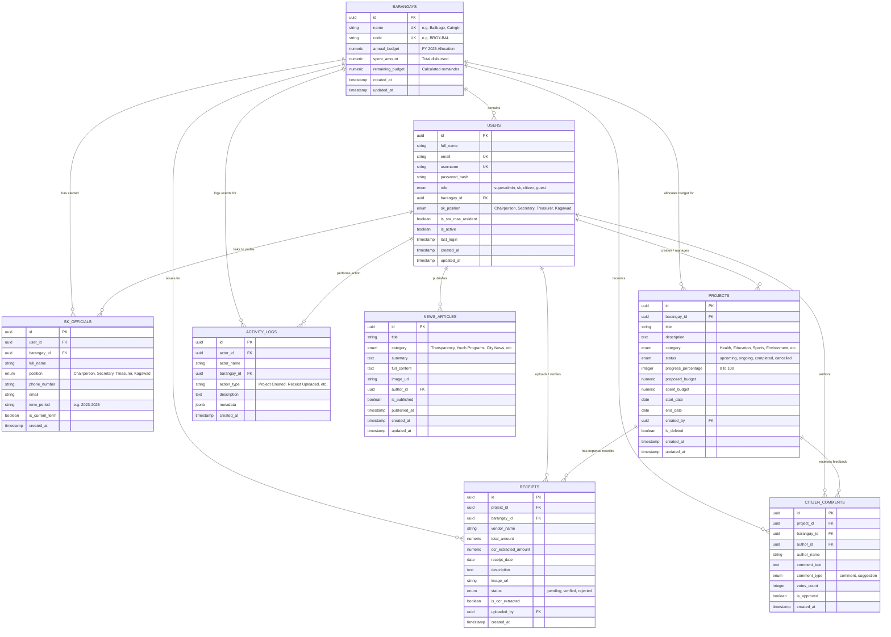

# eSKala — Entity-Relationship Diagram (ERD) & Database Schema
**Database Specification for PostgreSQL / Supabase Integration**

---

## 1. Complete Mermaid ERD Diagram



---

## 2. PostgreSQL DDL SQL Schema Script

```sql
-- =============================================================================
-- eSKala PostgreSQL Database Schema
-- Compatible with PostgreSQL 14+, Supabase, and Neon
-- =============================================================================

CREATE EXTENSION IF NOT EXISTS "uuid-ossp";

-- -----------------------------------------------------------------------------
-- ENUM TYPES
-- -----------------------------------------------------------------------------
CREATE TYPE user_role AS ENUM ('superadmin', 'sk', 'citizen', 'guest');
CREATE TYPE sk_position AS ENUM ('Chairperson', 'Secretary', 'Treasurer', 'Kagawad', 'Auditor', 'Peace Officer', 'Federation President');
CREATE TYPE project_status AS ENUM ('upcoming', 'ongoing', 'completed', 'cancelled');
CREATE TYPE project_category AS ENUM ('Health & Wellness', 'Education', 'Sports & Recreation', 'Infrastructure', 'Environment', 'Livelihood', 'Capacity Building', 'Peace & Order', 'Culture & Arts', 'Other');
CREATE TYPE receipt_status AS ENUM ('pending', 'verified', 'rejected');
CREATE TYPE comment_type AS ENUM ('comment', 'suggestion');

-- -----------------------------------------------------------------------------
-- TABLE: BARANGAYS
-- -----------------------------------------------------------------------------
CREATE TABLE barangays (
    id UUID PRIMARY KEY DEFAULT uuid_generate_v4(),
    name VARCHAR(100) NOT NULL UNIQUE,
    code VARCHAR(20) NOT NULL UNIQUE,
    annual_budget NUMERIC(12, 2) NOT NULL DEFAULT 0.00,
    spent_amount NUMERIC(12, 2) NOT NULL DEFAULT 0.00,
    created_at TIMESTAMP WITH TIME ZONE DEFAULT CURRENT_TIMESTAMP,
    updated_at TIMESTAMP WITH TIME ZONE DEFAULT CURRENT_TIMESTAMP
);

-- -----------------------------------------------------------------------------
-- TABLE: USERS
-- -----------------------------------------------------------------------------
CREATE TABLE users (
    id UUID PRIMARY KEY DEFAULT uuid_generate_v4(),
    full_name VARCHAR(150) NOT NULL,
    email VARCHAR(150) NOT NULL UNIQUE,
    username VARCHAR(80) UNIQUE,
    password_hash VARCHAR(255) NOT NULL,
    role user_role NOT NULL DEFAULT 'citizen',
    barangay_id UUID REFERENCES barangays(id) ON DELETE SET NULL,
    sk_position sk_position NULL,
    is_sta_rosa_resident BOOLEAN NOT NULL DEFAULT TRUE,
    is_active BOOLEAN NOT NULL DEFAULT TRUE,
    last_login TIMESTAMP WITH TIME ZONE NULL,
    created_at TIMESTAMP WITH TIME ZONE DEFAULT CURRENT_TIMESTAMP,
    updated_at TIMESTAMP WITH TIME ZONE DEFAULT CURRENT_TIMESTAMP
);

-- -----------------------------------------------------------------------------
-- TABLE: SK_OFFICIALS
-- -----------------------------------------------------------------------------
CREATE TABLE sk_officials (
    id UUID PRIMARY KEY DEFAULT uuid_generate_v4(),
    user_id UUID REFERENCES users(id) ON DELETE SET NULL,
    barangay_id UUID NOT NULL REFERENCES barangays(id) ON DELETE CASCADE,
    full_name VARCHAR(150) NOT NULL,
    position sk_position NOT NULL,
    phone_number VARCHAR(30) NULL,
    email VARCHAR(150) NULL,
    term_period VARCHAR(50) NOT NULL DEFAULT '2023–2025',
    is_current_term BOOLEAN NOT NULL DEFAULT TRUE,
    created_at TIMESTAMP WITH TIME ZONE DEFAULT CURRENT_TIMESTAMP
);

-- -----------------------------------------------------------------------------
-- TABLE: PROJECTS
-- -----------------------------------------------------------------------------
CREATE TABLE projects (
    id UUID PRIMARY KEY DEFAULT uuid_generate_v4(),
    barangay_id UUID NOT NULL REFERENCES barangays(id) ON DELETE CASCADE,
    title VARCHAR(255) NOT NULL,
    description TEXT NULL,
    category project_category NOT NULL DEFAULT 'Education',
    status project_status NOT NULL DEFAULT 'upcoming',
    progress_percentage INT NOT NULL DEFAULT 0 CHECK (progress_percentage BETWEEN 0 AND 100),
    proposed_budget NUMERIC(12, 2) NOT NULL DEFAULT 0.00,
    spent_budget NUMERIC(12, 2) NOT NULL DEFAULT 0.00,
    start_date DATE NOT NULL,
    end_date DATE NOT NULL,
    created_by UUID REFERENCES users(id) ON DELETE SET NULL,
    is_deleted BOOLEAN NOT NULL DEFAULT FALSE,
    created_at TIMESTAMP WITH TIME ZONE DEFAULT CURRENT_TIMESTAMP,
    updated_at TIMESTAMP WITH TIME ZONE DEFAULT CURRENT_TIMESTAMP
);

-- -----------------------------------------------------------------------------
-- TABLE: RECEIPTS
-- -----------------------------------------------------------------------------
CREATE TABLE receipts (
    id UUID PRIMARY KEY DEFAULT uuid_generate_v4(),
    project_id UUID REFERENCES projects(id) ON DELETE CASCADE,
    barangay_id UUID NOT NULL REFERENCES barangays(id) ON DELETE CASCADE,
    vendor_name VARCHAR(200) NOT NULL,
    total_amount NUMERIC(12, 2) NOT NULL DEFAULT 0.00,
    ocr_extracted_amount NUMERIC(12, 2) NULL,
    receipt_date DATE NOT NULL,
    description TEXT NULL,
    image_url VARCHAR(500) NULL,
    status receipt_status NOT NULL DEFAULT 'pending',
    is_ocr_extracted BOOLEAN NOT NULL DEFAULT FALSE,
    uploaded_by UUID REFERENCES users(id) ON DELETE SET NULL,
    created_at TIMESTAMP WITH TIME ZONE DEFAULT CURRENT_TIMESTAMP
);

-- -----------------------------------------------------------------------------
-- TABLE: CITIZEN_COMMENTS
-- -----------------------------------------------------------------------------
CREATE TABLE citizen_comments (
    id UUID PRIMARY KEY DEFAULT uuid_generate_v4(),
    project_id UUID REFERENCES projects(id) ON DELETE CASCADE,
    barangay_id UUID NOT NULL REFERENCES barangays(id) ON DELETE CASCADE,
    author_id UUID REFERENCES users(id) ON DELETE CASCADE,
    author_name VARCHAR(150) NOT NULL,
    comment_text TEXT NOT NULL,
    comment_type comment_type NOT NULL DEFAULT 'comment',
    votes_count INT NOT NULL DEFAULT 0,
    is_approved BOOLEAN NOT NULL DEFAULT TRUE,
    created_at TIMESTAMP WITH TIME ZONE DEFAULT CURRENT_TIMESTAMP
);

-- -----------------------------------------------------------------------------
-- TABLE: NEWS_ARTICLES
-- -----------------------------------------------------------------------------
CREATE TABLE news_articles (
    id UUID PRIMARY KEY DEFAULT uuid_generate_v4(),
    title VARCHAR(255) NOT NULL,
    category VARCHAR(80) NOT NULL DEFAULT 'City News',
    summary TEXT NULL,
    full_content TEXT NULL,
    image_url VARCHAR(500) NULL,
    author_id UUID REFERENCES users(id) ON DELETE SET NULL,
    is_published BOOLEAN NOT NULL DEFAULT TRUE,
    published_at TIMESTAMP WITH TIME ZONE DEFAULT CURRENT_TIMESTAMP,
    created_at TIMESTAMP WITH TIME ZONE DEFAULT CURRENT_TIMESTAMP,
    updated_at TIMESTAMP WITH TIME ZONE DEFAULT CURRENT_TIMESTAMP
);

-- -----------------------------------------------------------------------------
-- TABLE: ACTIVITY_LOGS
-- -----------------------------------------------------------------------------
CREATE TABLE activity_logs (
    id UUID PRIMARY KEY DEFAULT uuid_generate_v4(),
    actor_id UUID REFERENCES users(id) ON DELETE SET NULL,
    actor_name VARCHAR(150) NOT NULL,
    barangay_id UUID REFERENCES barangays(id) ON DELETE SET NULL,
    action_type VARCHAR(150) NOT NULL,
    description TEXT NULL,
    metadata JSONB NULL,
    created_at TIMESTAMP WITH TIME ZONE DEFAULT CURRENT_TIMESTAMP
);

-- -----------------------------------------------------------------------------
-- INDEXES FOR PERFORMANCE
-- -----------------------------------------------------------------------------
CREATE INDEX idx_users_email ON users(email);
CREATE INDEX idx_users_role ON users(role);
CREATE INDEX idx_users_barangay ON users(barangay_id);
CREATE INDEX idx_projects_barangay ON projects(barangay_id);
CREATE INDEX idx_projects_status ON projects(status);
CREATE INDEX idx_receipts_project ON receipts(project_id);
CREATE INDEX idx_receipts_barangay ON receipts(barangay_id);
CREATE INDEX idx_comments_project ON citizen_comments(project_id);
CREATE INDEX idx_activity_actor ON activity_logs(actor_id);
CREATE INDEX idx_activity_barangay ON activity_logs(barangay_id);
```
