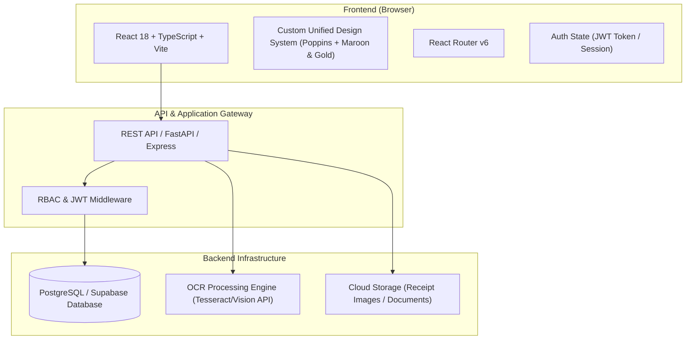

# eSKala — System Walkthrough & Architecture Specification
**Santa Rosa City, Laguna · Sangguniang Kabataan Financial Transparency & Governance Portal**

---

## 1. Executive Summary & Vision

**eSKala** is a web-based financial transparency, project tracking, and citizen engagement portal built for the **Sangguniang Kabataan (SK) Federation of the City of Santa Rosa, Laguna**.

Governed by **Republic Act 10742** (*SK Reform Act of 2015*) as amended by **Republic Act 11768**, the platform provides:
1. **Public Financial Transparency**: Citizens across all 18 barangays can track youth fund utilization, project budgets, and disbursements in real time.
2. **Operational Tools for SK Officials**: Specialized, position-gated dashboards for SK Chairpersons, Secretaries, and Treasurers to manage projects, upload payment receipts, track progress, and log audit trails.
3. **City-Wide Administration**: Centralized command for the City Youth Development Office (CYDO) and Super Admins to monitor all 18 barangay units, manage accounts, audit activity logs, and publish official announcements.
4. **Civic Feedback & Engagement**: Citizen channels to submit suggestions, comment on active projects, and vote on community initiatives.

---

## 2. Technology Stack & System Architecture

### 2.1 Technology Matrix
- **Frontend Framework**: React 18 with TypeScript (`tsc`), Vite 5 build toolchain
- **Styling**: Pure CSS design tokens (`index.css`), sharp geometry, graph-paper grid background, cursor & scroll reactive ambient lighting, responsive CSS grid/flexbox
- **Typography**: Poppins (Primary display font) & Inter (Data tables and body copy)
- **Design System Color Tokens**:
  - `Primary Maroon`: `#760031` (Government authority & brand core)
  - `Dark Maroon`: `#520022`
  - `Accent Gold`: `#FEEC41` (Youth dynamism)
  - `Canvas Background`: `#F8F6F0` (Parchment grid layout)
- **Target Database**: PostgreSQL 15+ / Supabase
- **Target Backend API**: Python FastAPI / Node.js Express

---

## 3. Role-Based Access Control (RBAC) Matrix

| Feature / Module | Guest (Unauthenticated) | Citizen | SK Kagawad | SK Secretary | SK Treasurer | SK Chairperson | Super Admin (CYDO) |
| :--- | :---: | :---: | :---: | :---: | :---: | :---: | :---: |
| **Landing & Login / Register** | ✅ | ✅ | ✅ | ✅ | ✅ | ✅ | ✅ |
| **City-Wide Financial Overview** | ✅ | ✅ | ✅ | ✅ | ✅ | ✅ | ✅ |
| **SK Officials Directory** | ✅ | ✅ | ✅ | ✅ | ✅ | ✅ | ✅ |
| **City News & Announcements** | ✅ (Read) | ✅ (Read) | ✅ (Read) | ✅ (Read) | ✅ (Read) | ✅ (Read) | 🛠 (CRUD) |
| **Barangay Budget Utilization** | ✅ (View) | ✅ (View) | ✅ (View) | ✅ (View) | ✅ (View) | ✅ (View) | ✅ (All 18) |
| **Submit Comments / Suggestions** | ❌ | ✅ | ✅ | ✅ | ✅ | ✅ | ✅ |
| **Create / Edit Projects** | ❌ | ❌ | ❌ | ✅ | ❌ | ✅ | ✅ |
| **Upload / OCR Scan Receipts** | ❌ | ❌ | ❌ | ❌ | ✅ | ✅ | ✅ |
| **View Audit Trail / Activity Logs** | ❌ | ❌ | ❌ | 🔒 (Own Brgy) | 🔒 (Own Brgy) | 🔒 (Own Brgy) | ✅ (City-Wide) |
| **Manage User Accounts** | ❌ | ❌ | ❌ | ❌ | ❌ | ❌ | ✅ (Full) |

---

## 4. Complete Page-by-Page Walkthrough

### 4.1 Landing Page (`/`)
- **Top News Ticker**: Smooth infinite marquee displaying live city headlines, announcements, and policy updates.
- **Header Navigation**: Quick links (`HOME`, `CITY OVERVIEW`, `ABOUT`, `SKs`), brand logo strip (eSKala, Santa Rosa City Seal, CYDO, Bagong Pilipinas), and CTA buttons (`LOGIN`, `SIGN UP`).
- **Hero Grid (Two-Column)**:
  - *Left*: Brand title `eSKala`, mission summary, and live statistics (18 Barangays, ₱39M+ SK Funds Released, 141 Active Projects).
  - *Right*: Interactive Kickoff News Card with fallback image handler, title, summary, and internal mini-stats.
- **Footer**: Legal version tags, terms link, privacy link, and RA 10742 reference.

### 4.2 Login Page (`/login`)
- **Layout**: Two-column landing shell matching the exact landing page design language.
- **Left Hero Panel**: SK role breakdown legend (Super Admin, SK Officer, Citizen) and recent news teaser cards.
- **Right Login Card**:
  - Credential input (accepts either `username` or `email`).
  - Password input with show/hide toggle.
  - Interactive "Show Sample Accounts (Demo)" drawer for instant testing across 4 roles (Super Admin, Chairperson, Treasurer, Citizen).

### 4.3 Register Page (`/register`)
- **Layout**: Matching two-column landing shell format.
- **Left Panel**: Citizen benefit cards (View Reports, Comment & Suggest, Know Officials, Stay Informed) + RA 10173 Data Privacy Notice panel.
- **Right Form Card**:
  - Full Name, optional `@username`, Email address.
  - Barangay selector (dropdown with all 18 Santa Rosa City barangays).
  - Santa Rosa Resident toggle (`Yes` / `No`).
  - Password with real-time strength meter (`Weak`, `Good`, `Strong`).
  - Terms & Conditions checkbox agreement.

### 4.4 Public City Overview (`/home`)
- **Summary Stat Cards**: Total City SK Budget (₱43.08M), Disbursed Funds, Remaining Budget, and Active Projects.
- **Project Status Cards**: Count of Ongoing, Upcoming, and Completed projects across the city.
- **Main Grid**:
  - *Left*: Active & upcoming project list with progress bars, proposed vs. spent budget breakdown, and status badges.
  - *Right*: Latest city news sidebar + per-barangay budget utilization progress bars for all 18 barangays.

### 4.5 About Page (`/about`)
- **Mission Statement**: Core mandate on transparency and accountability.
- **Key Feature Grid**: 6 cards detailing Public Trust, SK Operational Clarity, City Oversight, Citizen Participation, Receipt Intelligence, and RBAC.
- **Legal Framework & Contact**: Summary of RA 10742, RA 11768, Data Privacy Act of 2012, DILG Full Disclosure Policy, and CYDO contact info.

### 4.6 SK Officials Directory (`/sks`)
- **Directory Controls**: Position filter tabs (`All`, `Chairperson`, `Secretary`, `Treasurer`, `Kagawad`), Barangay dropdown, and live text search.
- **Official Cards**: Displays initials avatar colored by position, full name, barangay, position badge, contact number, email, and term (2023–2025).

### 4.7 Citizen Dashboard (`/citizen/home`)
- **Barangay Context**: Scoped to the logged-in citizen's barangay (default: `Balibago`).
- **Financial Header**: Annual budget, spent amount, remaining funds, and visual progress bar.
- **Local Activity & Feedback**: Project cards for the barangay, citizen comment list, and interactive comment submission form.

### 4.8 Citizen Projects (`/citizen/projects`) & My SKs (`/citizen/mysks`)
- **Projects View**: Widescreen budget utilization summary, status filter tabs with counts (`All`, `Ongoing`, `Upcoming`, `Completed`), search bar, and 2-column project cards.
- **My SKs View**: Barangay info banner, official roster grid, and community feedback list.

### 4.9 SK Officer Portal (`/sk/home` & `/sk/projects`)
- **Role-Gated Controls**:
  - *Chairperson / Secretary*: Button to open "Add New Project" modal.
  - *Chairperson / Treasurer*: Button to open "Upload Receipt (OCR)" zone.
- **Dashboard**: Financial breakdown, project progress bars, SK council members, activity audit stream, and receipt verification list.

### 4.10 Super Admin Portal (`/superadmin/home`, `accounts`, `activity`, `news`)
- **Admin Dashboard**: Toggle between City Overview (18 barangays) and Barangay Detail deep-dive.
- **Account Management**: Search users by name/email/username, filter by role/barangay, suspend/reactivate buttons, and Create SK Account modal.
- **System Activity Audit**: Filterable log of all system events with action icons, actor names, dates, and descriptions.
- **News Management**: Publish and edit city-wide news articles via modal form with category tags.

---

## 5. Mock Data Architecture & File Map

| File Path | Description | Key Exports |
| :--- | :--- | :--- |
| `frontend/src/types.ts` | Complete TypeScript interfaces | `Role`, `SKPosition`, `UserAccount`, `ReportProject`, `NewsItem`, `SKOfficial`, `CitizenComment`, `ActivityLog`, `Receipt`, `AccountRecord` |
| `frontend/src/data/mockData.ts` | Factual mock dataset for 18 barangays | `BARANGAYS`, `barangaySummary`, `cityHighlights`, `skOfficials`, `projects`, `news`, `citizenComments`, `activityLogs`, `accounts`, `receipts` |
| `frontend/src/services/auth.ts` | Mock authentication service | `getStoredUser()`, `login()`, `register()`, `logout()`, `initialUsers` |
| `frontend/src/index.css` | Unified design system tokens & components | Design tokens, `.landing-shell`, `.app-shell`, `.card`, `.stat-card`, `.badge`, `.btn`, etc. |
| `frontend/src/App.tsx` | Main router & cursor/scroll reactive shell | React Router routes, header, navbar, role gating |
